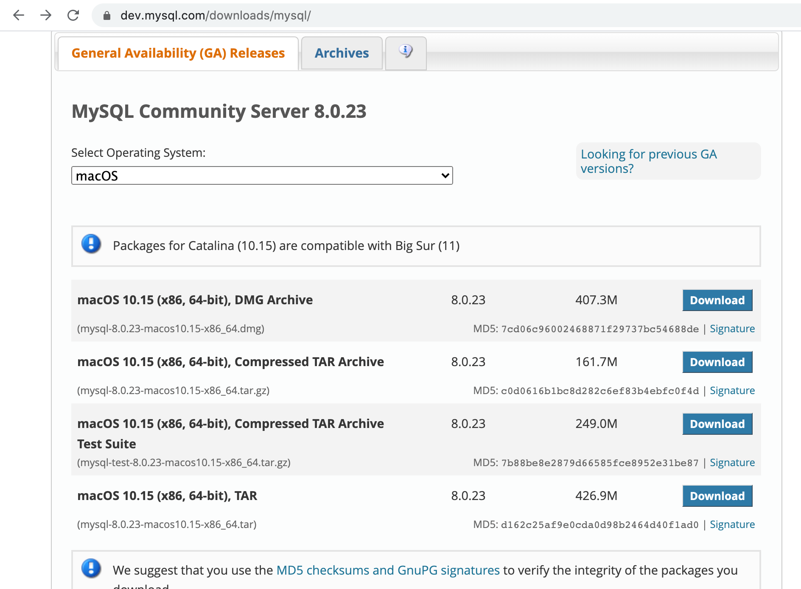
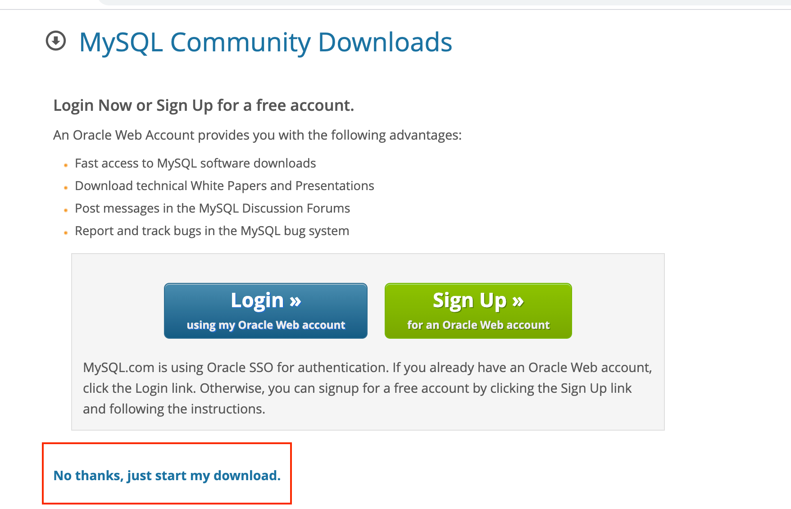
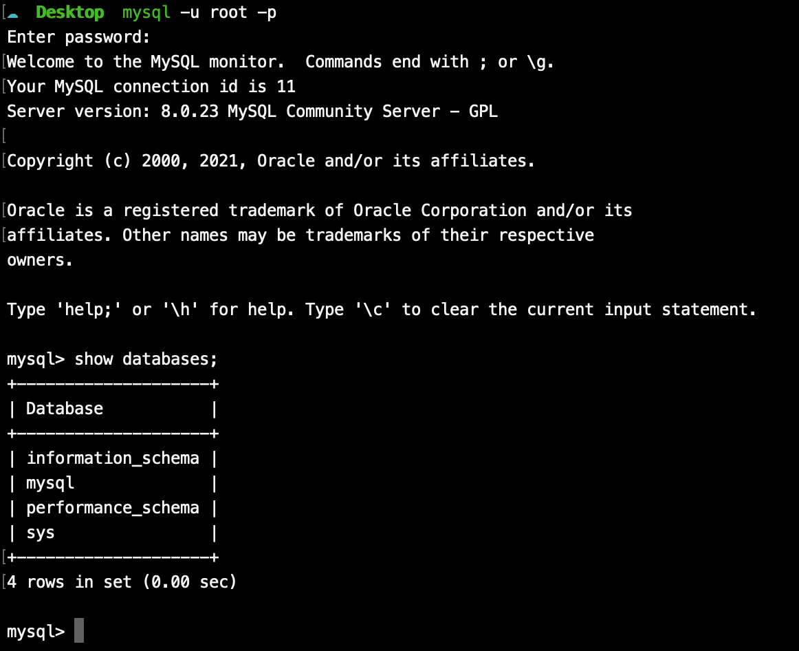
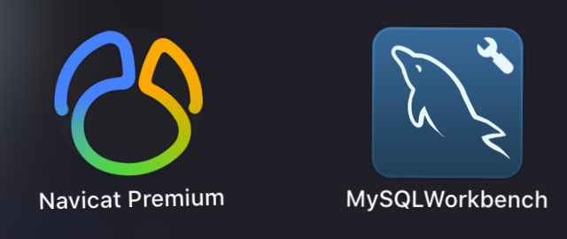
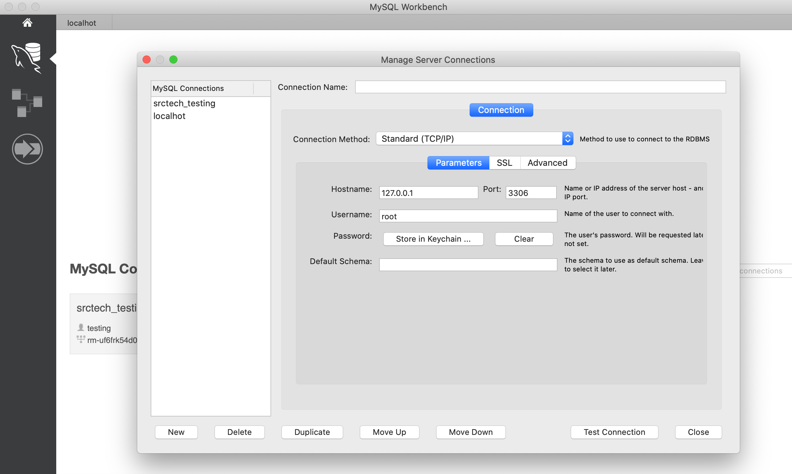
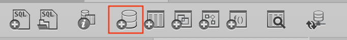
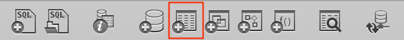
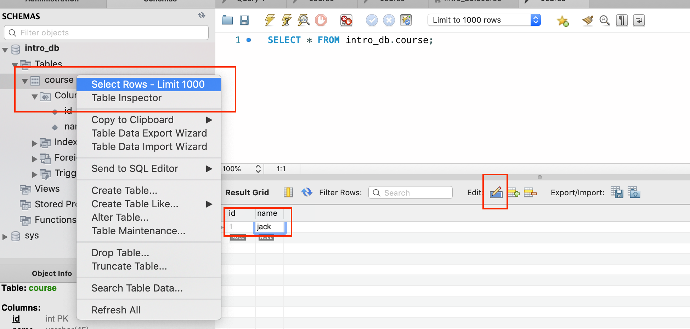

#Assignment 1

## Overview

The first assignment is to set up a local database environment and be able to perform basic operations using the client.

This task is an opportunity to:

* Learn how to launch the database service
* Get familiar with using a client to connect the database service and perform basic operations, which can be useful for you in the future.

**Release Date:** March 05, 2021 / 15:25

**Due Date:** March 05, 2021 / 17:10


----

## Quick Start

Before setting up a local database in your own computer, you can try with computers in laboratory.

* In the desktop, you will see a folder named **"数据库引论"**
* Then double click the **"Mysql Workbench.exe"** inside to start the application.
* You will also see a txt file called **"mysql_password"**, which will be used when connecting.


Once you establish connection successfully, you can try this [simple task](#simple-task)

## 

## Specification

Then you need to install both mysql-server and mysql-client in your own computer. 

### Server

[Download Address](https://dev.mysql.com/downloads/mysql/)  You can come [here](https://zhuanlan.zhihu.com/p/37152572) for reference

!!! hint
    Please choose the version that corresponds to your operating system




Then click the <u>No thanks, just start my download.</u>




If you have installed and configured the environment path, you can try the following commands to determine whether the installation is successful

```shell
$ mysql -u root -p

mysql> show databases;
```



### Client

We recommend these two client tools



Download address:

!!! hint
    Please choose the version that corresponds to your operating system

* [Navicat](https://www.navicat.com.cn/products/navicat-for-mysql) (It's not free)
* [Mysql Workbench](https://dev.mysql.com/downloads/workbench/)




* the default port will be 3306


### Simple task

After all the above steps are completed, you are required to do following

* **create a new schema**

=== "use command"
    ```CREATE SCHEMA `intro_db` ;```

=== "user client tool"
    
	

* **Create a new table**

=== "use command"
    ```
    CREATE TABLE `intro_db`.`course` (
        `id` INT NOT NULL,
        `name` VARCHAR(45) NOT NULL, 
    PRIMARY KEY (`id`));
    ```

=== "user client tool"
    


* **Insert a new data**

=== "use command"
    ```
	Insert into `intro_db`.`course` (id, name) values (2, 'amy');
    ```
=== "user client tool"
    

