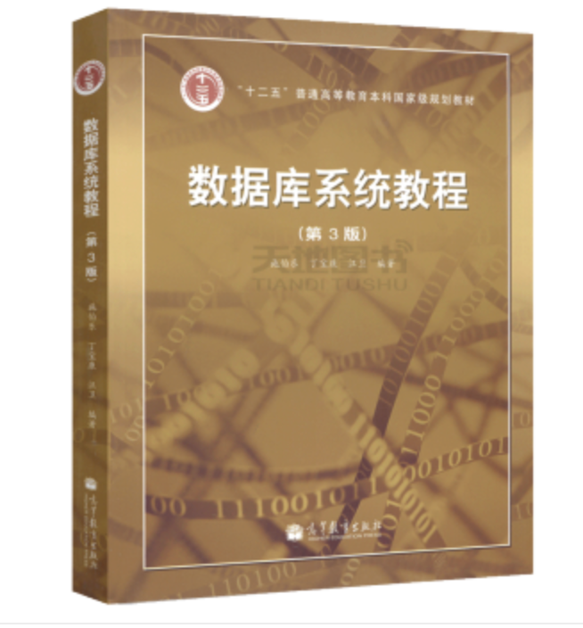

# COURSE INFORMATION

> **COMP130010h.01: Introduction of Database**

> College of Computer Science and Technology, Fudan University

- **Meeting Time:** **Tuesday 11-13 / Friday 8-9**
- **Lecture Location:** **HGX 201 / H Computing Centre 3# {~~Room 2~~} {++Room 3++}** 
- **Final: Wed/2021-06-30 13:00-15:00**

## Overview
!!! Info  "Course Objective"
    This course is designed to introduce the database system and help students to become proficient in its application.

Topics include:

* Data models (relational, document, key/value)
* Storage models (n-ary, decomposition)
* Query languages (SQL, stored procedures)
* Storage architectures (heaps, log-structured)
* Indexing (order preserving trees, hash tables)
* Transaction processing (ACID, concurrency control)
* Recovery (logging, checkpoints)
* Query processing (joins, sorting, aggregation, optimization)
* Parallel architectures (multi-core, distributed)

---

## Homeworks

There will be roughly weekly homework. These will generally consist of a number of written problems. ***Since there are also laboratory classes, theres homework will not involve any programming.***

!!! important
    **You are welcome to discuss these problems with other students, but this should be limited to discussions of high-level strategies and concepts. The actual write-up of the solutions must be your own.**

Homeworks needs to be submitted in class **<mark><u>Every Tuesday</u></mark>**. They can either be handwritten or  typed (LATEX is recommended) and print. However, your work must be clear and legible to receive credit.

Written solutions will not be posted, but the homework problems may be reviewed in **Q&A recitations**.

---

## Assignments

In the first few weeks, there are several simple assignments to help students understand the practicalities of database operation, which are very easy since we will provide detailed instructions.

We will post each assignment here in **<u>Friday's class</u>**, and students are required to complete the work and have it checked by TAs **{++in class++}**.

* [Assignment-1](Assignment/assignment1.md)

----

## Projects

In this course, students will be required to complete **two course projects**.

`Project-1` will be posted after the completion of the first few weeks of assignments and `project-2` will be assigned after `project-1`. Students will have plenty of time to complete both projects, which will not be too difficult and will focus more on the understanding and application of databases.

* [Project-1](Project/project-1.md)
* [Project-2](Project/project-2.md)

----

## Textbook

**数据库系统教程(第3版)施伯乐，丁宝康，汪卫 著 高等教育出版社 本科研究生教材 高等教育出版社**

**Database Management Systems, 3rd Edition.  By Raghu Ramakrishnan, Jhannes Gehrke** 

----

## TAs

**Xuanjie Fang**

> Software Engineering, College of Computer Science and Technology
>
> **Email:** 20212010015@fudan.edu.cn
>
> **location:**  J-Cross-science-2  E4006-02

**Jie Shi**

> Software Engineering, College of Computer Science and Technology
>
> **Email:** 20212010016@fudan.edu.cn
>
> **location:**  J-Cross-science-2  E4006-03

-----

## Exams

**Final: Wed/2021-06-30 13:00-15:00**

**Closed book**

----

## Grading

Grades will be weighted as follows:

| Items                | Weight |
| -------------------- | ------ |
| Midterm Exams        | 25%    |
| Final Exams          | 40%    |
| Assignments/Projects | 35%    |

If you have questions about the grading schema, please email us for contaction.

